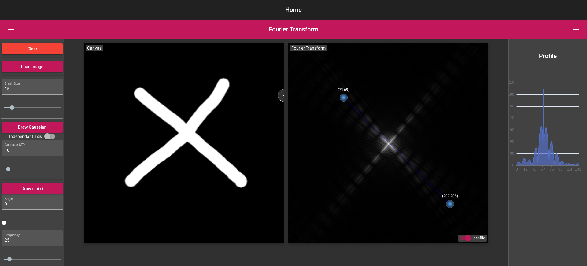
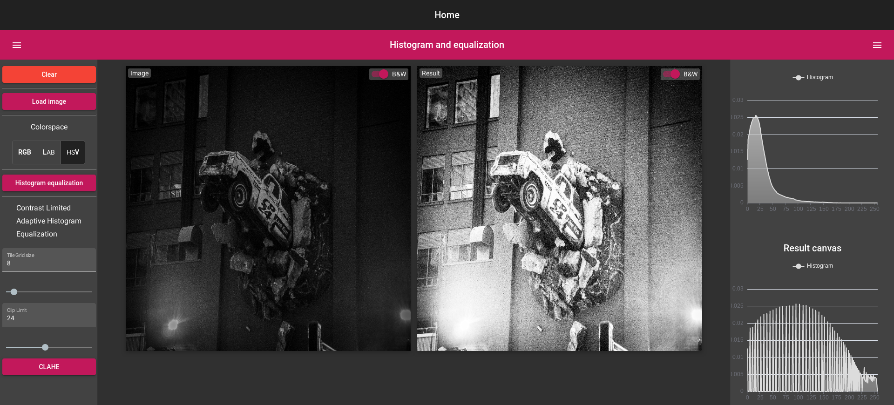

# The Computer Vision Toolbox

This is the source code for the [Computer-Vision Online Pedagogical Toolbox](https://clementpla.github.io/ComputerVisionToolbox/home)

This project proposes a serie of visualization tools to better grasp fundamentals notion of computer vision.
It is on-going! Feel free to suggest new ideas of tools and visualizations!
**Interactivity is the key**

## Examples of modules
### Interactive 2D Fourier Transform

### Histogram Equalization and CLAHE

# For Developpers 

This project was generated with [Angular CLI](https://github.com/angular/angular-cli) version 13.3.1.

## Development server

Run `ng serve` for a dev server. Navigate to `http://localhost:4200/`. The application will automatically reload if you change any of the source files.

## Build

Run `ng build` to build the project. The build artifacts will be stored in the `dist/` directory.
